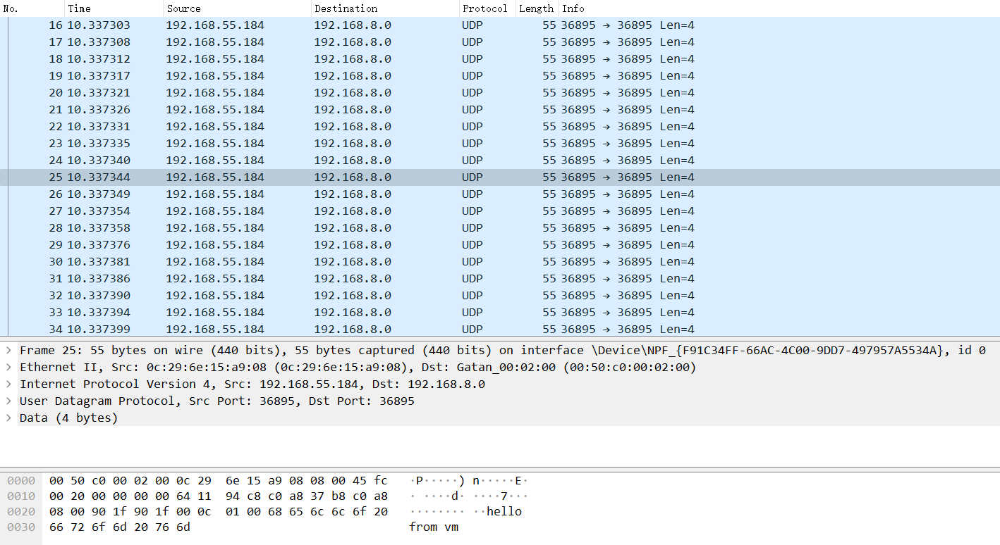

# dpdk

### Q1: What's the purpose of using hugepage?
(1) 在使用内存范围一定的条件下减少需要的page table entry, 减少TLB miss rate;

(2) 减少页表级数，提高page table查询效率;
=======
## Part1

### Q1: What's the purpose of using hugepage?
(1) 在使用内存范围一定的条件下减少需要的page table entry, 减少TLB miss rate;

(2) 减少页表级数，降低查表过程中访问内存的次数, 提高page table查询效率;

(3) 发生一次page fault分配更多内存, 从而减少page fault的次数;

(4) 增加程序使用的物理内存的连续性;

### Q2: Take examples/helloworld as an example, describe the execution flow of DPDK programs?
````c
int main(int argc, char **argv) {
  int ret;
  unsigned lcore_id;
  /*STEP1: 初始化环境抽象层EAL(Environment Abstraction Layer), 如果初始化失败则报错 */
  ret = rte_eal_init(argc, argv);
  if (ret < 0) rte_panic("Cannot init EAL\n");
  /* STEP2: 遍历EAL提供的LCORE, 对于每一个worker CPU核加载线程运行lcore_hello函数  */
  /* call lcore_hello() on every worker lcore */
  RTE_LCORE_FOREACH_WORKER(lcore_id) {
    rte_eal_remote_launch(lcore_hello, NULL, lcore_id);
  }
  

  /* STEP3: 在主CPU核运行lcore_hello函数 */
  lcore_hello(NULL);
  
  /* STEP4: 等待各LCORE上的线程运行结束 */
  rte_eal_mp_wait_lcore();

  /* STEP5: 清理ELA, 程序结束 */
  rte_eal_cleanup();

  return 0;
}
````
主要执行流为: 初始化ELA环境 -> 在其他worker LCORE和main core上加载线程执行对应的函数 -> 等待各cpu core上的线程结束 -> 清理ELA环境

### Q3: Read the codes of examples/skeleton, describe DPDK APIs related to sending and receiving packets.

#### API related to receiving packets:

````static inline uint16_t rte_eth_rx_burst(uint16_t port_id, uint16_t queue_id, struct rte_mbuf **rx_pkts, const uint16_t nb_pkts)````

````
@param port_id
Port id
@param queue_id
The index of the receive queue from which to retrieve input packets.
@param rx_pkts
The address of the buffer(缓冲区地址)
@param nb_pkts
The maximum number of packets to retrieve.
@return
The number of packets actually retrieved
````

#### API related to sending packets:

````static inline uint16_t rte_eth_tx_burst(uint16_t port_id, uint16_t queue_id, struct rte_mbuf **tx_pkts, uint16_t nb_pkts)````

````
@param port_id
The port identifier of the Ethernet device.
@param queue_id
The index of the transmit queue through which output packets must be sent.
@param tx_pkts
The address of the buffer(缓冲区地址)
@param nb_pkts
The maximum number of packets to transmit.
@return
The number of output packets actually stored in transmit descriptors of the transmit ring.
````

### Q4:  Describe the data structure of 'rte_mbuf'.

````
void rte_pktmbuf_init(struct rte_mempool *mp, __rte_unused void *opaque_arg, void *_m, __rte_unused unsigned i) {
  struct rte_mbuf *m = _m;
  uint32_t mbuf_size, buf_len, priv_size;

  priv_size = rte_pktmbuf_priv_size(mp);
  mbuf_size = sizeof(struct rte_mbuf) + priv_size;
  buf_len = rte_pktmbuf_data_room_size(mp);

  memset(m, 0, mbuf_size);
  /* start of buffer is after mbuf structure and priv data */
  m->priv_size = priv_size;
  m->buf_addr = (char *)m + mbuf_size;
  m->buf_iova = rte_mempool_virt2iova(m) + mbuf_size;
  m->buf_len = (uint16_t)buf_len;

  /* keep some headroom between start of buffer and data */
  m->data_off = RTE_MIN(RTE_PKTMBUF_HEADROOM, (uint16_t)m->buf_len);

  /* init some constant fields */
  m->pool = mp;
  m->nb_segs = 1;
  m->port = RTE_MBUF_PORT_INVALID;
  rte_mbuf_refcnt_set(m, 1);
  m->next = NULL;
}
````
 - rte_mbuf有priv_size, buf_addr, buf_iova, buf_len等
=======
 - rte_mbuf有priv_size, buf_addr,  buf_len, type, buf_len等字段用于描述ret_mbuf的元数据(如包的长度, 还有包的type和所属端口等常量)
 - 在结构上, rte_mbuf首先是header_room, 之后是data_room, 最后还有tail_room以备扩展
 - buf_addr指向header_room的起始
 - data_off表示data_room段距离包起始地址的offset,使用buf_addr+data_off可以得到data段的起始地址
 - 整个包的长度为buf_len, 为header_room, data_room和tail_room的长度和

## Part2

### 截图:



 - "hello from vm"为UDP包的内容
 - 根据截图, 发包类型正确(UDP), UDP包的内容"hello from vm"与程序中发送的内容一致, 其src和dst与程序中发送的内容一致`src:192.168.55.184(0xB837A8C0), dst:192.168.8.0(0x8A8C0)`, ether_addr的src和dst也与程序中填充的一致(截图中包的0-5字节和6-11字节), 因此编写的UDP发包程序正确

### 实现细节:

在main函数中首先初始化EAL和0号端口(之后使用0号端口发送UDP包), 并为0号端口初始化mempool, 之后调用````lcore_main````函数发送包, ````port_init````复用了````dpdk/examples/skeleton/basicfwd.c````中的````port_init````函数.

````c
int main(int argc, char *argv[]) {
  struct rte_mempool *mbuf_pool;
  unsigned nb_ports;
  uint16_t portid;
  /* Initialize the Environment Abstraction Layer (EAL). */
  int ret = rte_eal_init(argc, argv);
  if (ret < 0) rte_exit(EXIT_FAILURE, "Error with EAL initialization\n");
  argc -= ret;
  argv += ret;
  /* Creates a new mempool in memory to hold the mbufs. */
  mbuf_pool =
      rte_pktmbuf_pool_create("MBUF_POOL", NUM_MBUFS, MBUF_CACHE_SIZE, 0, RTE_MBUF_DEFAULT_BUF_SIZE, rte_socket_id());
  /* Initialize all ports. */
  if (port_init(0, mbuf_pool) != 0)
    rte_exit(EXIT_FAILURE, "Cannot init port %" PRIu16 "\n", portid);

  lcore_main(mbuf_pool);

  return 0;
}
````

````lcore_main````中填写````BURST_SIZE````个包并使用````rte_pktmbuf_free````函数发送, 其中每个包有三层包头(分别为````ethernet header````, ````ipv4 header````, ````udp header````), 包中data段填写的内容为````hello from vm````.

````c
void lcore_main(struct rte_mempool *mbuf_pool) {
  struct rte_mbuf *bufs[BURST_SIZE];
  int ether_hdr_len = sizeof(struct rte_ether_hdr);
  int ipv4_hdr_len = sizeof(struct rte_ipv4_hdr);
  int udp_hdr_len = sizeof(struct rte_udp_hdr);
  for (int i = 0; i < BURST_SIZE; i++) {
    bufs[i] = rte_pktmbuf_alloc(mbuf_pool);
    struct rte_ether_hdr *ether_hdr =
        rte_pktmbuf_mtod(bufs[i], struct rte_ether_hdr *);
    struct rte_ipv4_hdr *ipv4_hdr =
        (struct rte_ipv4_hdr *)(rte_pktmbuf_mtod(bufs[i], char *) +ether_hdr_len);
    struct rte_udp_hdr *udp_hdr =
        (struct rte_udp_hdr *)(rte_pktmbuf_mtod(bufs[i], char *) +
ether_hdr_len + ipv4_hdr_len);
    char *data = (char *)(rte_pktmbuf_mtod(bufs[i], char *) + ether_hdr_len + ipv4_hdr_len + udp_hdr_len);

    struct rte_ether_addr s_addr = {{0x0c, 0x29, 0x6e, 0x15, 0xa9, 0x08}};
    struct rte_ether_addr d_addr = {{0x00, 0x50, 0xc0, 0x00, 0x02, 0x00}};
    ether_hdr->d_addr = d_addr;
    ether_hdr->s_addr = s_addr;
    ether_hdr->ether_type = 0x0008;

    ipv4_hdr->version_ihl = RTE_IPV4_VHL_DEF;
    ipv4_hdr->type_of_service = RTE_IPV4_HDR_DSCP_MASK;
    ipv4_hdr->total_length = 0x2000;
    ipv4_hdr->packet_id = 0;
    ipv4_hdr->fragment_offset = 0;
    ipv4_hdr->time_to_live = 100;
    ipv4_hdr->src_addr = 0xB837A8C0;
    ipv4_hdr->next_proto_id = 17;
    ipv4_hdr->dst_addr = 0x8A8C0;
    ipv4_hdr->hdr_checksum = rte_ipv4_cksum(ipv4_hdr);

    udp_hdr->src_port = 8080;
    udp_hdr->dst_port = 8080;
    udp_hdr->dgram_len = 0x0c00;
    udp_hdr->dgram_cksum = 1;

    *data = 'h';
    *(data + 1) = 'e';
    *(data + 2) = 'l';
    *(data + 3) = 'l';
    *(data + 4) = 'o';
    *(data + 5) = ' ';
    *(data + 6) = 'f';
    *(data + 7) = 'r';
    *(data + 8) = 'o';
    *(data + 9) = 'm';
    *(data + 10) = ' ';
    *(data + 11) = 'v';
    *(data + 12) = 'm';
    bufs[i]->pkt_len = bufs[i]->data_len =
        ether_hdr_len + ipv4_hdr_len + udp_hdr_len + 13;
  }
  uint16_t nb_tx = rte_eth_tx_burst(0, 0, bufs, BURST_SIZE);
  printf("%d packets sent successfully", BURST_SIZE);

  for (int i = 0; i < BURST_SIZE; i++) rte_pktmbuf_free(bufs[i]);
}
````

### 运行
````sh
$ make
$ ./build/udp
# 如果遇到形如`cannot open shared object file: No such file or directory`的错误可以使用如下指令
$ sudo ldconfig
````
